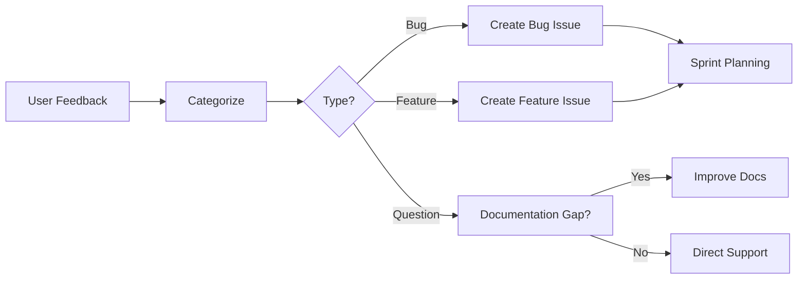

# Development Methodology

## 🎯 **Overview**

This document outlines our development methodology for the Kob Git Updater plugin, transitioning from initial development to user-feedback-driven iterations post WordPress.org submission.

## 📋 **Core Principles**

### **1. User-Driven Development**
- **Real User Feedback**: WordPress.org support forums as primary input source
- **Issue-Based Planning**: GitHub issues linked to user pain points
- **Data-Driven Decisions**: Usage analytics and error logs guide priorities

### **2. Quality First**
- **Test-Driven Development**: No feature ships without tests
- **Code Standards**: WordPress coding standards compliance maintained
- **Security by Design**: Security reviews for all user-facing changes

### **3. Continuous Improvement**
- **Iterative Releases**: Small, frequent updates over large releases
- **Feedback Loops**: Weekly user feedback review sessions
- **Technical Debt**: Dedicated time for refactoring and optimization

## 🔄 **Development Workflow**

### **Sprint Structure (2 weeks)**

#### **Week 1: Planning & Development**
```bash
# Day 1-2: Sprint Planning
- Review WordPress.org support requests
- Analyze user feedback and GitHub issues
- Prioritize features/bugs using impact/effort matrix
- Create GitHub milestones and issues

# Day 3-8: Development
- Feature development with TDD approach
- Code review via GitHub PRs
- Documentation updates
- Docker testing environment validation
```

#### **Week 2: Testing & Release**
```bash
# Day 9-12: Quality Assurance
make test              # Full test suite
make test-lint         # Code standards
make docker-dev        # Integration testing
make build             # Production build

# Day 13-14: Release & Monitoring
- WordPress.org release (if applicable)
- GitHub release with changelog
- Monitor for immediate issues
- Prepare next sprint based on feedback
```

## 🛠 **Technical Standards**

### **Code Quality Gates**

#### **1. Development Stage**
```bash
# Required before any commit
make test              # All tests must pass
php -l src/**/*.php    # Syntax validation
```

#### **2. Pull Request Stage**
```bash
# Automated checks via GitHub Actions (future)
make test-lint         # WordPress coding standards
make test-analyze      # PHPStan static analysis
make test-security     # Composer security audit
```

#### **3. Release Stage**
```bash
# Pre-release validation
make build             # Production build successful
make test-integration  # WordPress environment testing
make validate          # Project structure validation
```

### **Branch Strategy**

```
main                   # Production-ready code (WordPress.org releases)
├── develop           # Integration branch for features
├── feature/ISSUE-123 # Feature branches from GitHub issues
├── hotfix/critical   # Critical fixes for immediate release
└── release/1.4.0     # Release preparation branches
```

### **Commit Convention**
```
type(scope): description

Types: feat, fix, docs, style, refactor, test, chore
Scopes: core, admin, github, repository, updates, build, docker

Examples:
feat(github): add support for GitHub Enterprise
fix(updates): resolve false positive update detection
docs(readme): update installation instructions
test(core): add container dependency injection tests
```

## 📊 **Issue Management**

### **GitHub Issue Template Structure**

#### **Bug Report**
```markdown
**Description**: Clear bug description
**Environment**: WordPress version, PHP version, plugin version
**Steps to Reproduce**: Numbered steps
**Expected vs Actual**: What should happen vs what happens
**Logs**: Relevant error logs or debug output
**Priority**: Low/Medium/High/Critical
```

#### **Feature Request**
```markdown
**Use Case**: Why is this needed?
**Proposed Solution**: How should it work?
**Alternatives Considered**: Other approaches evaluated
**Impact**: Who benefits and how?
**Implementation Notes**: Technical considerations
```

### **Priority Matrix**

| Impact | Effort | Priority | Action |
|--------|--------|----------|---------|
| High | Low | 🔴 Critical | Immediate |
| High | High | 🟡 Important | Next Sprint |
| Low | Low | 🟢 Nice-to-have | Backlog |
| Low | High | ⚪ Consider | Archive/Reject |

## 📈 **User Feedback Integration**

### **Feedback Sources**

#### **1. WordPress.org Support Forums**
- **Monitor Daily**: Check for new support requests
- **Response SLA**: <24 hours for initial response
- **Issue Creation**: Convert to GitHub issues for tracking
- **Resolution Follow-up**: Ensure user satisfaction

#### **2. GitHub Issues**
- **Technical Users**: Direct bug reports and feature requests
- **Developer Community**: Contributions and enhancements
- **Documentation**: Wiki updates and documentation improvements

#### **3. Usage Analytics (Future)**
```php
// Anonymous usage tracking (opt-in)
- Feature usage statistics
- Error frequency tracking
- Performance metrics
- WordPress version compatibility
```

### **Feedback Processing Workflow**



## 🚀 **Release Management**

### **Release Types**

#### **Patch Releases (1.3.x)**
- **Frequency**: As needed (hotfixes)
- **Content**: Bug fixes, security updates
- **Testing**: Regression tests + affected areas
- **Timeline**: 1-2 days from issue to release

#### **Minor Releases (1.x.0)**
- **Frequency**: Monthly or bi-monthly
- **Content**: New features, improvements
- **Testing**: Full test suite + user acceptance testing
- **Timeline**: 2-4 weeks development cycle

#### **Major Releases (x.0.0)**
- **Frequency**: Annually or as needed
- **Content**: Breaking changes, architecture updates
- **Testing**: Extensive compatibility testing
- **Timeline**: 3-6 months development cycle

### **Release Checklist**

#### **Pre-Release**
- [ ] All tests passing (`make test`)
- [ ] Documentation updated (README, WARP.md, CHANGELOG)
- [ ] Version bumped in all files
- [ ] Production build created (`make build`)
- [ ] GitHub release prepared with changelog

#### **Release**
- [ ] WordPress.org SVN updated (for minor/major releases)
- [ ] GitHub release published
- [ ] Documentation sites updated
- [ ] Announcement prepared (if significant)

#### **Post-Release**
- [ ] Monitor for immediate issues (48 hours)
- [ ] Support forum monitoring increased
- [ ] Error log analysis
- [ ] User feedback collection

## 📚 **Documentation Standards**

### **Code Documentation**
```php
/**
 * WordPress-style DocBlocks for all public methods
 * 
 * @param string $param Description of parameter
 * @return array Description of return value
 * @throws InvalidArgumentException When parameter invalid
 * @since 1.3.2
 */
public function example_method( string $param ): array {
    // Implementation
}
```

### **User Documentation**
- **README.md**: Installation, basic usage, troubleshooting
- **WARP.md**: Technical documentation for developers
- **Wiki Pages**: Advanced usage, integrations, FAQ

### **Change Documentation**
- **CHANGELOG.md**: All user-facing changes
- **GitHub Releases**: Detailed release notes with links
- **Migration Guides**: For breaking changes

## 🔧 **Development Environment**

### **Local Development Setup**
```bash
# Quick start for new contributors
git clone https://github.com/kobkob/kob-git-updater.git
cd kob-git-updater
make install          # Install dependencies
make docker-dev       # Start development environment
make test             # Verify setup
```

### **IDE Configuration**
- **PHPStorm/VSCode**: Project configuration files included
- **Code Standards**: PHPCS configuration for WordPress standards
- **Debugging**: Xdebug configuration for Docker environment
- **Testing**: PHPUnit configuration with coverage

### **CI/CD Pipeline (Future)**
```yaml
# GitHub Actions workflow
on: [push, pull_request]
jobs:
  test:
    - PHP 8.1, 8.2, 8.3
    - WordPress 6.0, 6.4, latest
    - MySQL 5.7, 8.0
  security:
    - Composer security audit
    - PHPCS WordPress standards
    - PHPStan static analysis
  build:
    - Production build validation
    - Documentation generation
```

## 📋 **Success Metrics & KPIs**

### **Development Metrics**
- **Code Coverage**: Maintain >80%
- **Test Suite**: <10 seconds execution time
- **Build Time**: <2 minutes for production build
- **Issue Response Time**: <24 hours average

### **User Metrics**
- **Active Installations**: Growth rate
- **User Rating**: WordPress.org rating average
- **Support Satisfaction**: Forum response quality
- **Feature Adoption**: Usage of new features

### **Quality Metrics**
- **Bug Reports**: Rate per release
- **Security Issues**: Zero tolerance policy
- **Performance**: Page load impact <50ms
- **Compatibility**: Support 95%+ of target WordPress/PHP versions

## 🎯 **Next Steps**

### **Immediate (Week 1-2)**
1. **Submit to WordPress.org** using SUBMISSION-GUIDE.md
2. **Set up monitoring** for WordPress.org support forums
3. **Create GitHub issue templates** for user feedback
4. **Establish weekly feedback review** process

### **Short Term (Month 1-2)**
1. **User feedback analysis** and first iteration planning
2. **Documentation improvements** based on user questions
3. **Performance optimization** based on real usage patterns
4. **Community building** through responsive support

### **Medium Term (Month 3-6)**
1. **Feature roadmap** based on user requests
2. **Integration opportunities** with popular tools
3. **Advanced features** for power users
4. **Plugin ecosystem** expansion possibilities

---

**This methodology evolves with the project. Regular retrospectives will refine the process based on what works best for our user community and development team.**